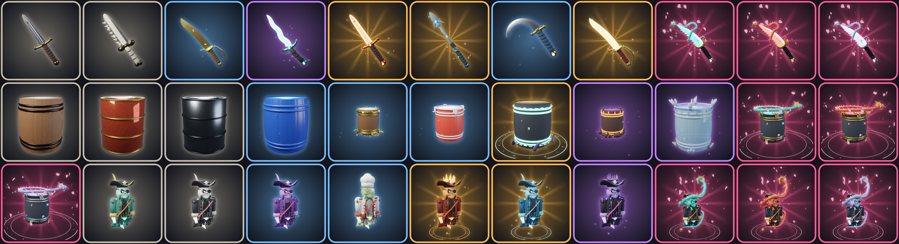

# Phase 17 — Blender 스킨 · 로비 정리 · 출시 준비

게임 파일: `output/CursedBarrel_Phase17_Skins.rbxl` (Phase 16 파일 대신 이것을 여세요)
새 Blender 모델: `export/CursedBarrelSkins.fbx` (아래 **해 주실 것 2번**에서 한 번만 가져오기)
상점 그림: `thumbnails/cards/*.png` 33장 (미리보기: `docs/skin_cards_preview.png`)



## 바꾼 것

| 말씀하신 것 | 바꾼 것 |
|---|---|
| 해적 · 통 · 검 스킨 퀄리티를 Blender 로 | **칼 7모양**을 새로 만들었습니다: 단검 · 뼈칼 · 곡도 · 물결 크리스 · 작살 · 갈고리 · 용의 송곳니. 날 · 날선 · 코등이 · 손잡이 · 감은 끈 · 폼멜 · 보석이 따로 칠해져서 스킨마다 색이 다릅니다. 상점 · 전시대 · **통에 꽂히는 칼**까지 전부 이 모델입니다 |
| 전에 받은 해적은 없애고 새로 | Creator Store 해적(CustomPirate)을 쓰는 코드를 지웠습니다. 파일에 남아 있으면 게임이 켜질 때 치웁니다. **새 해적 한 벌**: 삼각 모자(금 테 · 해골 문장 · 깃털), 안대, 빛나는 한쪽 눈, 해초 수염, 금 견장, 긴 코트 자락, 띠 · 벨트 · 버클 · 쇠사슬, 레이스 소매, 갈고리 손, 유령 손, 안개 꼬리. 턱이 벌어지고 팔을 뻗고 몸을 숙이는 동작은 그대로 움직입니다 |
| 해적 스킨마다 다르게 | 좀비 요리사 = 요리사 모자 · 크라켄 = 촉수 수염 · 공허의 왕 = 가시 왕관 · 잿불 망령 = 불꽃 왕관 · 심해의 인어 = 지느러미 · 조개 장식 · 용 세트 = 용뿔 · 갈기 |
| 통도 같이 | 통 장식 6종: 보물(금 띠 · 징 · 보석 · 발밑 금화) · 김치통(잠금 고리) · 화산(현무암 · 흘러내리는 용암) · 유빙(얼음 결정 · 고드름) · 심연(발밑 촉수 · 빛나는 룬 띠) · 용의 봉인(뚜껑을 움켜쥔 금 발톱 · 사슬 · 부적). **칼이 꽂히는 가운데 띠는 비워 뒀습니다** |
| 비쌀수록 이펙트 · 파티클 · 퀄리티 | 희귀도마다 한 겹씩 더합니다 (아래 표) |
| 비싼 검은 용이 돌고 꽃잎이 떨어지게 | 신화 칼(용의 송곳니 3종) = **Blender 용이 칼 둘레를 돌고 벚꽃잎이 흩날립니다.** 통에 꽂힌 칼은 날이 통 속에 있으니 손잡이 쪽을 감고 돕니다. 신화 통 = 용이 뚜껑 위를 돌고, 신화 해적 = 용이 몸을 감고 돕니다 |
| 통 스킨 가격 20% 인하 | 아래 표 (끝자리는 게임의 다른 값처럼 900 으로 맞춤) |
| 파란 드럼통 위치 | 스폰 오른쪽(뱃머리 위) → **계단을 내려오자마자 오른쪽 앞** (주 갑판 x 20, z 101). 계단 폭(x ±6) 밖이고 J 테이블과도 떨어져 있어 지나는 길을 막지 않습니다 |
| "그룹가입 + 좋아요 부탁드려요" 문구 | 받침대: **👥 그룹 가입 보상 / 👍 좋아요 부탁드려요! / 파란 철제 드럼 무료!** (영어: Please like the game!) · 받기 창 문구도 같이 바꿨습니다. 좋아요는 Roblox 가 확인할 방법을 주지 않아서 보상 조건이 아니라 부탁입니다 (규정 위반 방지) |
| 토너먼트 게시판이 허접함 | 네모 판 하나 → **나무 게시판**: 세로 판자 · 굵은 틀 · 금 못 · 기둥 둘 · 금 모자, 위에 빨간 "🏆 토너먼트 챔피언" 간판과 금 트로피, 기둥 사이 삼각 깃발 줄, 앞뒤 등불. 판에는 규칙 한 줄 · 시즌 이름 · 순위 10줄(1~3등 금 · 은 · 동, 얼굴 사진, 점수). **앞뒤 양쪽**에 그립니다 |
| 랭킹 게시판 뒷면에도 | 명예의 문 판 3개 모두 **뒷면에도 같은 순위**가 나옵니다 (계단 아래에서 올려다봐도 보임). 뒷면 쪽 등불 · 못 추가 |
| 문어 다리 Blender 적용 안 됨 | 원인: 움직이는 다리는 마디마다 **둥근 공(파트) 관절**과 **원통 배 살(파트)**이 그대로 남아 있어서 Blender 마디가 가려졌습니다. 이제 Blender 캡슐 마디(끝이 둥글고 주름진 살결)끼리 겹쳐서 이음새를 덮고, 공 관절 · 원통 배 살은 쓰지 않습니다 → 이어진 한 줄기 다리로 보입니다 (`docs/kraken_arm_preview.png`) |
| 상점에 사진 | 상점 카드의 3D 그림이 이제 Blender 모델로 보입니다 (따로 할 일 없음). Blender 로 그린 카드 그림 33장도 드립니다 — 올리고 ID 를 넣으면 3D 대신 그 그림이 보입니다 (선택, 아래) |
| 상점이 작동 안 함 | 원인: 로벅스 상품 · 게임패스 ID 가 전부 `0` 이라 "준비 중"으로 막혀 있었습니다. **이제 ID 는 `ReleaseConfig.lua` 맨 위 한 곳에만 적으면 됩니다** (`C.ProductIds` · `C.GamePassIds`). 코인으로 사는 스킨은 원래대로 됩니다 |

### 비쌀수록 더 화려하게

| 등급 | 붙는 것 |
|---|---|
| 기본 | 색 · 재질 · Blender 모양 |
| 희귀 | + 반짝 빛나는 별 |
| 영웅 | + 피어오르는 불씨 |
| 전설 | + 발밑에서 도는 룬 고리(통 · 해적), 별 · 불씨가 더 많음, 튀는 불꽃 |
| 신화 | + **도는 용** · **흩날리는 벚꽃잎** · 무지갯빛 별가루 |

- 용 · 꽃잎 · 룬 고리는 각자 화면이 움직입니다 (서버 부담 없음). 한 번에 가까운 14개만 움직이고, 휴대폰(효과 "낮음")은 꽃잎을 1/3 로 줄입니다.
- 상점 카드의 작은 그림은 멈춘 모습, 그림을 눌러 크게 보면 움직입니다.

### 통 스킨 가격 (20% 인하)

| 스킨 | 전 | 후 |
|---|---|---|
| 기름 드럼통 · 폐유 드럼통 | 8,900 | **6,900** |
| 보물 상자 · 김치통 | 55,900 | **44,900** |
| 화산의 통 · 유빙의 통 | 140,900 | **112,900** |
| 심연의 통 | 262,900 | **209,900** |
| 청해룡 · 적염룡 · 월백룡의 봉인 | 499,000 | **399,000** |

## 해 주실 것

1. Studio 에서 `CursedBarrel_Phase17_Skins.rbxl` 열기
2. **홈 → 3D 가져오기 → `export/CursedBarrelSkins.fbx` → "단일 메시로 가져오기" 끄기 → 가져오기**
   - Workspace 에 `CursedBarrelSkins` 가 생기면 그대로 둡니다. 게임이 켜질 때 알아서 보관함으로 옮깁니다.
   - 조각이 111개라 올라가는 데 1~2분 걸릴 수 있습니다.
   - 안 하면 예전 모양으로 돌아가고 게임은 그대로 돌아갑니다. (둘 다 자동 검사로 확인했습니다)
   - `CursedBarrelModels`(Phase 15 대포 · 통 · 크라켄)는 이미 파일 안에 있어서 다시 안 해도 됩니다.
3. **파일 → Roblox에 게시** (상품을 만들려면 먼저 게시돼 있어야 합니다. 비공개로 둬도 됩니다)
4. Creator Hub 에서 **상품 6개 + 게임패스 2개**를 만들고 ID 를 `ReleaseConfig.lua` 맨 위에 넣기 (아래 표). 저에게 숫자만 보내 주셔도 됩니다
5. 그룹 ID 를 `ReleaseConfig.lua` 의 `C.GroupId` 에 (파란 드럼 보상이 열립니다)
6. Play 로 확인 → 게시

### Play 체크

- [ ] 출력 창에 `Blender 3D 모델을 찾았습니다: CursedBarrelSkins` 가 보인다
- [ ] 상점 → 칼 · 통 · 해적 탭 카드 그림이 새 모양이다. 신화 카드를 누르면 용이 돌고 꽃잎이 떨어진다
- [ ] 테이블에서 칼을 꽂으면 새 칼이 꽂힌다 (위험 자리는 붉게). 신화 칼은 손잡이 쪽에서 용이 돈다
- [ ] 통에서 튀어나오는 해적이 새 해적이다. 입 벌리기 · 팔 뻗기가 움직인다
- [ ] 스킨 전시장(선실)의 해적 · 통 · 칼이 새 모양이다
- [ ] 계단을 내려오면 오른쪽 앞에 파란 드럼 받침대가 있고, 계단 길을 막지 않는다. 글자: 그룹 가입 보상 · 좋아요 부탁드려요!
- [ ] 명예의 문 판 뒤쪽(계단 아래)에서도 순위가 보인다
- [ ] 토너먼트 테이블(J) 옆에 새 게시판이 있고 앞뒤로 순위가 보인다
- [ ] 바다의 크라켄 다리가 공 · 원통 이음새 없이 한 줄기로 보인다
- [ ] 휴대폰 화면(기기 보기)에서도 상점 · 로비가 버벅이지 않는다

## 출시에 필요한 ID — 어디서 얻고 어디에 넣나

Creator Hub = [create.roblox.com](https://create.roblox.com) → **Creations** → 이 게임

| 무엇 | 얻는 곳 | 넣는 곳 (`ReleaseConfig.lua`) | 꼭? |
|---|---|---|---|
| 코인 상품 5개 · 스타터 팩 | Monetization → Developer Products → Create → 그림 위 ⋯ → **Copy Asset ID** | `C.ProductIds` | ✅ (상점 로벅스 결제) |
| VIP · 현상금 부스터 | Monetization → Passes → Create → ⋯ → Copy Asset ID (Sales 에서 Item for Sale 켜기) | `C.GamePassIds` | ✅ |
| 그룹 ID | 그룹(커뮤니티) 페이지 주소의 숫자 `roblox.com/communities/12345678/...` | `C.GroupId` | ✅ (파란 드럼) |
| 버튼 그림 3개 | Studio → 보기 → 에셋 관리자 → 가져오기 → 우클릭 → Copy Asset ID | `C.Images.Attendance` · `C.Images.Roulette` · `C.Branding.ShopImage` | ✅ |
| 소리 17개 | Studio → 도구 상자 → Creator Store → 오디오 → 우클릭 → Copy Asset ID | `C.Audio` | 추천 |
| 스킨 카드 그림 33장 | `thumbnails/cards/*.png` 을 에셋 관리자로 한꺼번에 가져오기(여러 파일 선택) | `C.Images.Skins["Knife/gold"]` 처럼 (파일 이름 `Knife_gold.png` = 칸 `Knife/gold`) | 선택 |
| 꽃잎 그림 | `fx/petal.png` | `C.Images.Petal` | 선택 (신화에 꽃잎 입자 추가) |
| 배지 12개 | Engagement → Badges | `C.Badges` | 선택 |

⚠️ 알아 두실 것
- 상품 가격은 게임 표시값과 똑같이: 코인 소 159 · 중 319 · 대 369 · 특대 799 · 금고 1,999 · 스타터 99 · VIP 399 · 부스터 249 R$.
- **이 게임 안에서 만든 상품**이어야 합니다. 2026년 5월 30일부터 다른 게임의 상품은 팔 수 없습니다.
- 이미지를 올리면 Decal ID 가 나올 수 있습니다. 스크립트에 넣으면 안 보이니, 속성창(Image 칸)에 한 번 붙여 넣어 바뀐 **Image ID** 숫자를 쓰세요.
- 게임을 그룹 소유로 올리면 소리 · 애니메이션도 그룹 명의로 올려야 재생됩니다.
- Studio 에서 사는 것은 테스트 구매라 로벅스가 빠지지 않습니다.

## 전 연령 공개 조건 (Roblox 공식 문서, 2026)

- 16세 이상 공개(또는 신뢰하는 친구 공개)부터 필요: 계정 2일 이상 · **연령 확인**(얼굴 추정 또는 신분증) · **콘텐츠 성숙도 설문** 작성
- 전 연령(키즈 · Select 포함)은 추가로:
  - 본인 인증(18세 이상은 신분증) · **2단계 인증** 켜기
  - Roblox Plus/Premium 2개월 연속 유지 **또는** 환불형 게시 수수료 1,000 로벅스 (60일 동안 활발한 플레이어 25명이면 돌려받음)
  - 키즈 · Select 심사 통과
- 게임 내용: 해골 · 해적이 놀래는 연출 · 번개 · 화면 흔들림이 있습니다. 설문에 그대로 적으세요. `Dragon`(해적 등장) 소리는 너무 무서운 비명 대신 **해적 웃음 · 포효** 쪽을 고르시면 전 연령 심사에 유리합니다. 설정의 "번쩍임 · 연출 줄이기"는 이미 있습니다.

## 17.1 — 스크린샷 보고 고친 것

| 보신 것 | 원인 | 고친 것 |
|---|---|---|
| 문어 다리가 칼 전시장(선실)을 뚫고 들어옴 · 2층에 빨판만 떠 있음 · 전시장에 흰 타원이 줄지어 있음 | Studio 3D 가져오기가 Blender 조각을 **세로축으로 180° 돌려서** 넣습니다 (Phase 16 파일로 확인: 가져온 조각이 전부 카탈로그의 (-x, y, -z) 자리에 있음). 둥근 통 · 드럼은 티가 안 나지만, 갑판에 누운 문어 다리는 살이 제자리에서 뒤집혀 선실로 들어가고 빨판은 따로 떠 있었습니다. 흰 타원 줄 = 그 빨판입니다 | MeshKit 이 파일마다 두 조각의 자리를 카탈로그와 비교해 **돌림을 알아내서 되돌립니다** (돌려 넣었든 아니든 맞게 놓임). 누운 다리 · 대포(포구가 안쪽을 보던 것) · 크라켄 머리(눈썹이 뒤에 있던 것) · 움직이는 다리의 빨판 · 새 칼 · 해적 · 용이 모두 제 방향이 됩니다 |
| 통을 감싸는 빛나는 원이 못생김 | 통 몸통은 옆으로 누운 원통이라, 바닥에 깔려야 할 빛 고리(halo)가 통 뒤에 **세로로 선 큰 원판**이 됐습니다 | 통에서는 빛 고리를 없앴습니다 (게임 테이블 · 전시대 · 상점 모두). 통 발밑의 룬 고리도 뺐습니다. 통은 용 · 꽃잎 · 반짝임만 |
| 해적이 너무 밝음 | 밝은 살색 + 상점 창 조명이 셈 | 상점 카드 · 크게 보기의 해적 조명을 낮췄습니다. 전시대 해적의 몸 빛도 2 → 0.7 |
| 흰 조각이 날아다님 | 신화 스킨 꽃잎이 연한 분홍이라 조명 아래서 흰색으로 보임 | 진한 벚꽃색으로 바꾸고 크기 · 개수를 줄였습니다 (통 · 해적 12 → 8개) |

⚠️ 새 파일(`CursedBarrel_Phase17_Skins.rbxl`)에는 가져온 스킨 모델이 들어 있지 않습니다. **이미 가져오신 `CursedBarrelSkins` 를 복사해서 옮기면** 다시 가져올 필요가 없습니다:
1. 지금 쓰던 파일에서 탐색기 → Workspace → `CursedBarrelSkins` 오른쪽 클릭 → **복사**
2. 새 파일을 열고 Workspace 오른쪽 클릭 → **안에 붙여넣기** → 저장 · 게시

## 17.2 — 상점

- 상점 카드의 스킨이 **천천히 돌아갑니다** (상점이 열려 있을 때만, 초당 24번이라 휴대폰도 가볍게)
- 통 카드는 카메라를 조금 뒤로 빼서 잘리지 않습니다 (다른 스킨도 돌 때 안 잘리게 여유를 둠)
- 상점 창을 860 → 1010 너비로 넓히고 카드 사이 간격을 12 → 24 로 늘렸습니다 (작은 화면에서는 예전처럼 화면에 맞춰 줄어듭니다)

## 못 한 것 · 알아 두실 것

- Studio 실제 화면은 제가 볼 수 없습니다. 대신
  - 모든 스크립트 문법 검사 (68개) · 정적 분석
  - **자동 실행 검사 77개** (Lune 로 실제 모듈을 돌림): 칼 11 · 통 12 · 해적 10 스킨 만들기, 슬롯에 꽂기 · 위험 · 되돌리기, 칼끝 방향, 명예의 문 앞뒤, 드럼 자리 · 문구, 토너먼트 판, 용 · 꽃잎 · 룬 고리 움직임, 상점 3D 미리보기 33개
  - 같은 검사를 **새 FBX 를 안 넣은 상태**, **가져오기가 돌리지 않은 상태**로도 돌려서 모두 통과
  - 어색한 곳은 캡처를 보내 주세요.
- 게임 파일(.rbxl)은 **공개 GitHub 저장소에 올리지 않았습니다** (게임 코드 전체가 들어 있어서). 채팅으로 직접 드립니다. Blender 스크립트 · 모델 · 그림만 저장소에 있습니다.
- 가져오기 창의 단위 설정이 무엇이든 조각 크기 · 자리는 `SkinMeshCatalog` 값으로 다시 맞춥니다 (Phase 15 와 같은 방식).

## 다시 만들기 (Blender)

```bash
pip install bpy==4.5.14 pillow           # Blender 4.5 LTS 를 파이썬 모듈로
cd roblox-cursed-barrel/blender
python fx_textures.py                    # 꽃잎 · 별 · 룬 고리 그림
GAMECONFIG_LUA=.../GameConfig.lua python build_all.py export   # FBX + SkinMeshCatalog.lua
GAMECONFIG_LUA=.../GameConfig.lua python build_all.py thumbs   # 스킨 그림 33장 + 카드
```

스크립트를 .rbxl 에 넣기 · 검사 (Lune 0.10.5):

```bash
lune run tools/dump.luau 원본.rbxl 작업폴더          # 스크립트를 작업폴더/src 로 꺼내기
lune run tools/patch_place.luau 원본.rbxl 결과.rbxl 작업폴더/src   # 고친 스크립트를 넣어 새 파일로
lune run tools/smoke.luau 결과.rbxl                  # 자동 실행 검사 (nolib 을 붙이면 FBX 없는 상태)
```
