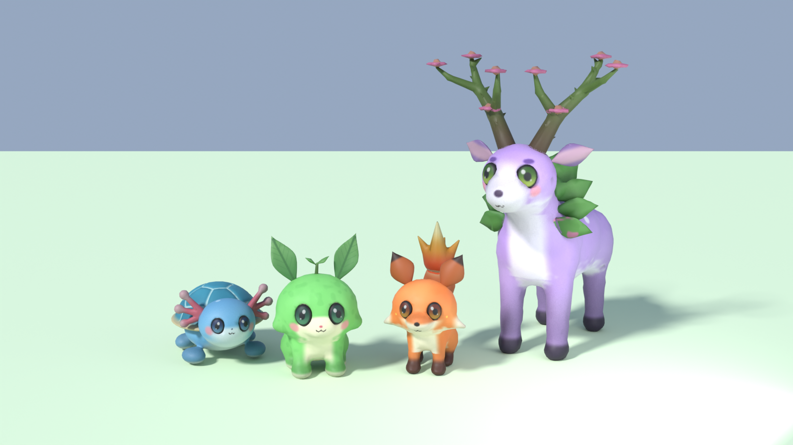
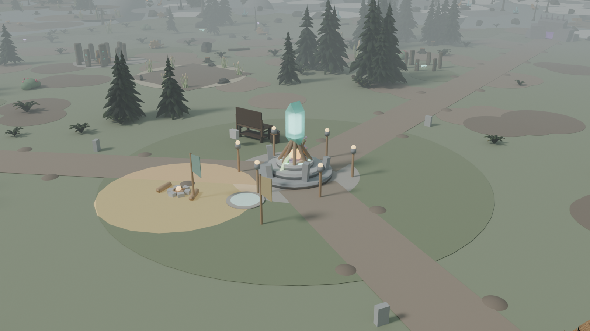
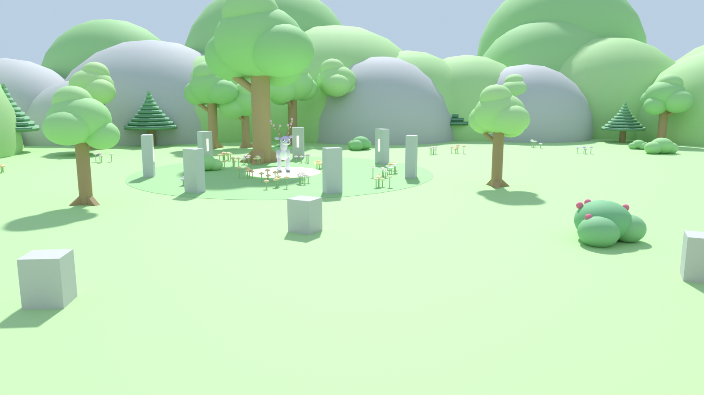
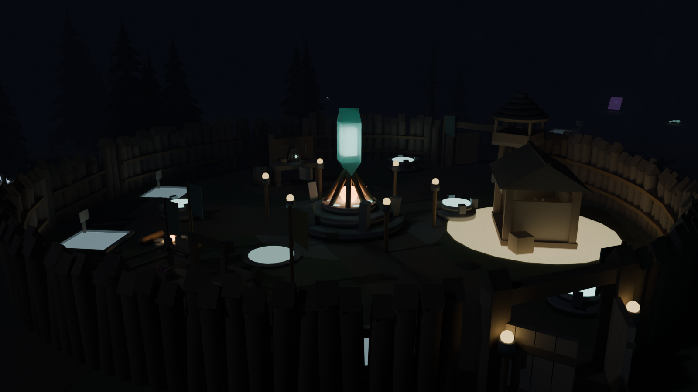
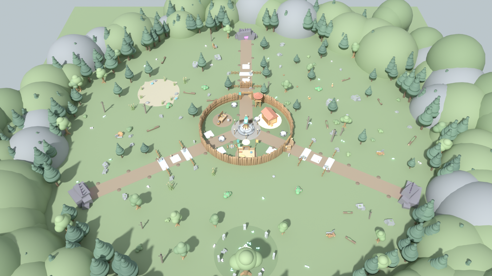
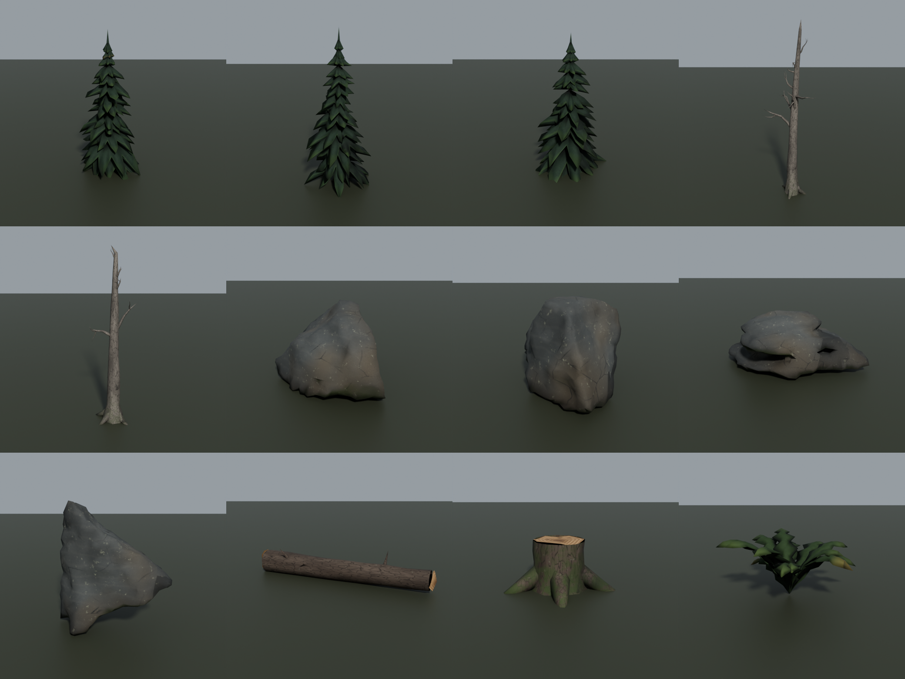

# WILDHOLD — 1~8단계 다시 만들기 (비주얼 · 펫 · 게임 느낌)

GPT 가 만든 1~8단계는 서버 로직은 대부분 쓸 만했지만, 화면은 **회색 판자 + 사방에 떠 있는 글씨**라서
무슨 게임인지 알아볼 수 없었다. 로직(서버 권한형, 포획 → 등록 → 밤 생존 → 영구 확정, 세션 잠금 저장)은 살리고
**보이는 것 전부와 게임 느낌을 새로 만들었다.**

> **2026-09-28 추가 결정:** 분위기를 99 Nights 같은 **생존 톤**으로 바꾸고, 맵을 **사실적인 숲**으로 다시 만들었다
> (블렌더 숲 키트: 가문비나무·고사목·이끼 바위·쓰러진 통나무, 흐린 낮 ↔ 짙은 안개의 밤, 모닥불 Core, 등불).
> 펫은 **성장형** — 아래 4종은 새끼 단계이고, 사나운 성체는 Meshy AI 로 만든다.
> 새 채팅을 이어갈 때는 [`docs/진행상황.md`](docs/진행상황.md), [`docs/내가_할_일.md`](docs/내가_할_일.md),
> [`docs/Meshy_질문_프롬프트.md`](docs/Meshy_질문_프롬프트.md) 를 본다.

> **2026-09-29 추가 결정:** **혼자 해도 재밌고 들어와서 30초 안에 시작**하는 게임. ARK·99 Nights 식 생존 제작
> (재료 → 제작대 레벨업 → 더 좋은 도구), 마인크래프트식 핫바, 가벼운 배고픔, **가로세로 5배 넓은 맵**(지름 약 1500, 지역 4곳),
> 한 판 5밤, 성장형 펫(Lv6 에 성체로 진화), 코인 보급 해금. 아래 맵 사진은 넓히기 전 모습이다.

> **2026-10-01 v2:** 빈 기지에서 시작 · 자동 요리(모닥불 곁) · 잡으면 바로 등록 · 가진 것 중 최고 도구로 채집 · 큰 가방(창고 없음) ·
> 창을 비스듬히 세워 쥐기 · 나무 흔들림/쓰러짐 · **빛기둥 보물상자**(일반/희귀/영웅) · 황금 노드(x3) · 목표 달성 보상 ·
> 지역별 소품과 **유적**(Blender `assets/ruins/RuinModels.fbx`). 새 place 는 **`WILDHOLD_v2.rbxlx`**, 쉬운 안내는 [`docs/v2_안내.md`](docs/v2_안내.md).



| 흐린 낮의 기지 | 숲과 알파의 숲 |
|---|---|
|  |  |

| 밤 (모닥불·횃불만 밝다) | 맵 전체 |
|---|---|
|  |  |



> 위 맵 이미지는 헤드리스 테스트가 실제 게임 코드로 만든 맵을 그대로 Blender 로 찍은 미리보기다 (숲 키트 메쉬 포함).
> Roblox 의 재질 질감·Future 조명·지형 풀 장식은 빠져 있어서 Studio 화면과는 다르다.

---

## 1. 바로 해보기

1. `WILDHOLD.rbxlx` 를 Roblox Studio 로 연다.
2. **플레이(F5)**. 4초 뒤 원정이 시작된다 (원정 중간에 들어와도 바로 합류).

| 조작 | PC | 휴대폰 |
|---|---|---|
| 들 것 고르기 | 1~9 키 · 마우스 휠 · 화면 아래 칸 클릭 | 화면 아래 칸 터치 |
| 쓰기 (공격·채집·먹기·덫 던지기·간식 주기) | 클릭 · F | 공격 버튼 |
| 사냥 시작 · 덫 · 등록 · 건설 · 제작대/모닥불 | E (가까이 가면 뜨는 버튼) | 뜨는 버튼 터치 |
| 펫 패널 (내 펫·야생·명령·제작·도감·🪙보급) | 🐾 버튼 | 🐾 버튼 |

처음엔 **노란 ⬇ 표시**와 왼쪽 위 목표 카드를 따라가면 된다: 야생 모슬링 포획 → 펫 우리 등록 → 도끼로 나무 → 창고 → 제작대 → 첫 밤.
3. 숲 키트와 블렌더 펫은 이미 들어 있다. (빠지면 파트로 만든 대체 모델로 나온다)

## 2. 숲 키트 (이미 들어 있음)

`assets/env/EnvModels.fbx` 한 파일에 사실적인 숲 모델 14개가 들어 있다. **이걸 넣어야 맵이 어두운 생존 숲으로 보인다.**

이미 한 번 Studio 로 가져와서 메쉬·텍스처가 Roblox 에 올라갔고, 그 결과를 `assets/env/EnvModels.rbxmx` 로 저장해 두었다.
`tools/build_place.py` 가 이것을 `ReplicatedStorage/EnvModels` 에 넣으므로 **`WILDHOLD.rbxlx` 를 열면 바로 숲 키트가 쓰인다.**

숲 키트를 고쳐서 다시 가져와야 할 때만:

1. **파일·폴더 경로에 한글이 없게** 한다 (예: `C:\WILDHOLD\`). 한글 경로에서는 텍스처 업로드가 `base_color_texture 업로드 실패` 로 실패했다.
2. Studio 상단 **홈 → 가져오기(Import 3D)** → `EnvModels.fbx` 선택 → 기본값 그대로 **가져오기** (텍스처 포함 확인).
3. 작업 공간에 생긴 `EnvModels` 를 **ReplicatedStorage** 로 끌어다 놓는다. 이름은 바꾸지 않는다.
   (깜빡해도 게임이 시작할 때 코드가 옮긴다. 안 넣으면 예전 파트 나무로 대체된다)
4. 탐색기에서 `EnvModels` 우클릭 → **파일로 저장** → `assets/env/EnvModels.rbxmx` 를 덮어쓰고 `python3 tools/build_place.py`.

| 에셋 | 개수 | 삼각형 |
|---|---|---|
| 가문비나무 / 뒷줄용 가벼운 가문비나무 | 3 / 2 | 3.4~4k / 1.4k |
| 고사목 | 2 | 0.7~0.9k |
| 바위 (둥근·납작·기둥) | 4 | 1.1~1.5k |
| 쓰러진 통나무, 그루터기, 고사리 | 각 1 | 0.2~0.8k |

## 3. 블렌더 펫 (이미 들어 있음)

`assets/pets/` 에 4종이 들어 있다: `Mossling.fbx`, `Emberpup.fbx`, `Shellbub.fbx`, `Briarhorn.fbx` (+ 텍스처 png, 수정용 .blend).
Studio 가져오기 결과를 `assets/pets/PetModels.rbxmx` 로 저장해 두어서 `WILDHOLD.rbxlx` 를 열면 `ReplicatedStorage/PetModels` 에 이미 들어 있다.

펫을 고치거나 새 펫을 넣을 때만 (**파일 경로는 영어로**):

1. Studio 상단 **홈 → 가져오기(Import 3D)** 를 누른다.
2. FBX 4개를 한꺼번에 선택해서 연다. 설정은 기본값 그대로 두고 **가져오기**.
   - 리그 종류가 나오면 **Custom (사용자 지정)**. 텍스처가 같이 올라가는지(Texture 체크) 확인.
3. 작업 공간(Workspace)에 `Mossling` 같은 모델 4개가 생긴다.
4. 탐색기에서 4개를 **ReplicatedStorage → PetModels** 폴더로 끌어다 놓는다. **이름은 바꾸지 않는다.**
   (깜빡하고 작업 공간에 둬도 게임이 시작할 때 서버가 옮긴다)
5. 다시 플레이하면 펫이 블렌더 모델로 바뀐다. place 에 고정하려면 PetModels 안의 모델들을 선택 → 우클릭 **파일로 저장** →
   `assets/pets/PetModels.rbxmx` 를 덮어쓰고 `python3 tools/build_place.py`.

코드가 알아서 처리하는 것: 크기(종별 키로 자동 맞춤), 앞/뒤 방향(뼈 위치로 자동 판별), 뼈 애니메이션(걷기·숨쉬기·꼬리·귀·공격·기절),
엠버펍 꼬리 불꽃 파티클, 알파 오라. 모델에 문제가 있으면 출력 창에 경고를 남기고 대체 모델로 표시한다.

| 펫 | 역할 | 삼각형 | 뼈 |
|---|---|---|---|
| 모슬링 | 풀 · 빠른 근접 | 6.9k | 몸·머리·잎귀·새싹·꼬리·다리4 |
| 엠버펍 | 불 · 원거리 | 7.2k | + 꼬리 2마디, 불꽃 끝 표시 뼈 |
| 셸버브 | 물 · 탱커 | 8.2k | + 아가미 2 |
| 브라이어혼 α | 풀 · 알파 | 9.6k | + 목 |

모두 독자 디자인이다 (포켓몬 등 기존 IP 와 겹치지 않게 만들었다).

## 4. 무엇이 바뀌었나

**2026-09-29: 생존 제작 · 넓은 맵 · 성장형 · 빠른 시작** (자세한 내용은 `docs/진행상황.md` 3.6)
- 핫바(`HotbarController`) + 도구 등급(`ItemConfig`, `Visuals/ToolLook`) + 제작대 Lv1~3·모닥불 요리(`RecipeConfig`, `CraftingService`)
- 배고픔(`SurvivalService`), 새 자원 버섯·수정, 가방
- 지름 약 1500 맵(`MapConfig`, `MapService`, `Modules/Zones`): 초원 · 🌋잿빛 바위 협곡 · 🌲고목의 숲 · 💧안개 늪, 스트리밍
- 성장형 펫(Lv6 진화), 새 펫 3종(이끼사슴·애쉬리자드·보그토드, 파트 모델), 5밤, 코인 보급 해금·도감 보상(`ShopConfig`)
- 노란 목표 표시·지역/기지 방향 표시, 시작 대기 4초, 중간 합류, 혼자일 때 괴물 체력 0.8배

**맵** (`MapService`, `Visuals/Props`, `Visuals/Structures`)
- 지형(Terrain): 올리브색 풀밭 + 낙엽 흙·진흙 얼룩, 흙길 3개, 경계 언덕과 바위, 연못(셸버브), 알파의 숲(브라이어혼)
- 숲: 키 큰 가문비나무 벽 3줄, 안쪽 나무 무리 16곳, 고사목·쓰러진 통나무·그루터기·이끼 바위·고사리 (숲 키트 메쉬)
- 기지: 말뚝 울타리 + 문 2개, 떠서 도는 **Core 수정 제단**, 공용 창고(입금 범위 표시), 제작대, 펫 우리, 모닥불, 횃불
- 방어 시설이 레벨마다 모양이 바뀜: 나무 말뚝벽 → 돌벽 → 강화 철판벽 / 목조 망루 → 돌 망루 → 청록 지붕 망루 / 나무 가시 → 철 가시
- 빈 자리는 청사진 틀 + 아이콘 표지판, 괴물은 길 끝 **보라색 굴**에서 나온다
- 자원 노드: 나무, 바위, 갈대, 폐기계 고철, 열매 덤불. 다 캐면 그루터기가 남고 다시 자란다

**크리처** (`CreatureController`, `Rig`, `Anim`, `Visuals/Creatures`)
- 서버는 보이지 않는 기준 파트만 움직이고, 클라이언트가 모델을 붙여 부드럽게 따라가며 지형 높이에 맞춘다
- 절차적 애니메이션: 대기(숨쉬기·두리번), 걷기(대각선 다리), 모슬링은 통통 뛰기, 공격 돌진, 기절, 포획 가능 상태에서 비틀비틀 + 별
- 밤의 괴물 4종 새로 디자인: 크롤러(딱정벌레), 러너(그림자 늑대), 브루트(바위 골렘), 울부짖는 자(보스)
- 이름표는 필요한 것만: 내 펫(임시면 노란색), 야생 펫(포획 기준선 25% 표시 + "포획 가능!"), 다친 괴물만 체력바

**효과** (`FXController`, `EnvironmentController`)
- 속성별 펫 공격: 잎 베기 / 불덩이 / 물보라 / 가시덩굴, 포탑 화살이 포물선으로 날아감
- **포획 바구니**가 떨어져 3번 흔들리고 성공하면 반짝, 실패하면 부서짐
- 낮 → 노을(밤 45초 전) → 밤 → 새벽으로 하늘·안개·색감이 부드럽게 바뀌고, 밤에는 횃불과 굴이 빛난다

**UI** (`UIController`, `PetController`, `WorldUI`)
- 위: 낮/밤 알약 + 타이머 + Core 체력, 왼쪽: 목표 카드 + **출전 펫 3칸(3D 얼굴)**, 아래: 자원(가방/창고)
- 큰 배너(원정 시작, 밤 경고, 밤 N, 새벽, 포획 성공, 영구 확정), 밤 비네트, 결과 화면
- 오른쪽 빠른 명령(🎯 사냥 / 🐾 따라와 / 🛡 지켜) + 펫 패널(모든 목록에 3D 얼굴, 도감은 미발견이면 그림자)

**고친 버그**
- 포탑이 바로 앞 벽에 시야가 막혀 **벽을 때리는 적을 한 번도 못 쏘던 문제** (원본에도 있던 문제). 화살은 벽 위로 넘어간다.

**설계 문서와 다른 점**: 벽 자리 7개(문 2 + 울타리 구멍 1 + 바깥 6), 포탑 4, 함정 4, 배치대 4. 맵 배치는 `MapConfig.lua` 에서 바꾼다.

## 5. 폴더

```text
wildhold/
├── WILDHOLD.rbxlx          # Studio 에서 여는 파일 (src 로 자동 생성)
├── src/                    # 모든 Luau 소스 (Rojo: default.project.json)
│   ├── shared/Config        # 수치
│   ├── shared/Visuals       # Build, Props, Structures, Creatures (모델 조립)
│   ├── server/Services      # 게임 로직 (서버 권한)
│   └── client/Controllers   # 화면: Creature, Rig, Anim, FX, Environment, UI, Pet, WorldUI, Audio
├── assets/pets/            # 블렌더 펫 FBX + 텍스처 + .blend + Studio 가져오기 결과 PetModels.rbxmx
├── assets/env/             # 숲 키트 EnvModels.fbx + 텍스처 + .blend + Studio 가져오기 결과 EnvModels.rbxmx
├── blender/                # 펫(sdf 조각 → 베이크 → 리깅 → FBX)과 숲 키트(env_kit.py)를 만드는 파이썬 스크립트
├── tests/                  # 헤드리스 플레이 테스트 (실제 Luau VM + Roblox API 모의)
└── tools/build_place.py    # src → WILDHOLD.rbxlx
```

## 6. 수정하고 다시 만들기

```bash
python3 tools/build_place.py                 # src 를 고친 뒤 rbxlx 다시 만들기
pip install bpy==4.2.0 scikit-image          # 펫 수정용 (한 번)
python3 blender/build_pets.py Mossling       # blender/pets.py 수정 후 해당 펫 FBX 다시 만들기
python3 blender/lineup.py                    # 4종 단체 렌더
python3 blender/env_kit.py --render          # 숲 키트 다시 만들기 + 단체 사진
```

## 7. 테스트 (Studio 없이)

`tests/run.sh` 는 실제 서버·클라이언트 스크립트를 Luau VM 에서 돌리며 한 판을 끝까지 진행한다.
Roblox 엔진은 모의 구현이지만, **모든 속성 쓰기를 실제 Roblox API 목록(@rbxts/types 에서 생성한 `tests/api.lua`)으로 검사**해서
없는 속성·읽기 전용 속성·잘못된 Enum·자료형 오류를 바로 잡아낸다.

검사 항목(현재 전부 통과): 맵 생성, 숲 키트 메쉬 14종 사용·자동 이동·파트 대체, HUD/패널, 창 장착, 펫 소환·표시, **블렌더 모델 경로(MeshPart + 뼈 애니메이션, 키 2.9 stud)**,
사냥 → 약화 → 포획(첫 포획 보장), 포획 FX, 채집 → 줍기 → 창고 입금, 벽 건설, 제작, 우리 등록, 배치대,
밤: 괴물 등장·처치, 포탑 사격, 펫 공격, 새벽 영구 확정, 2일차, 3밤 끝까지 결과.

```bash
# 준비: Luau 실행기 (tests/README 참고) 를 PATH 에 두고
./tests/run.sh
python3 tests/render_scene.py docs/images    # 테스트가 내보낸 맵을 Blender 로 렌더
```

## 8. 아직 확인하지 못한 것 (Studio 에서 꼭 볼 것)

- **실제 Studio 실행은 아직 못 했다.** 모의 엔진 테스트는 통과했지만 물리·렌더·실제 FBX 가져오기는 Studio 에서만 확인된다.
- FBX 가져오기 결과: 크기·방향은 코드가 자동 보정하지만, 텍스처가 안 붙으면 가져오기 창의 텍스처 설정을 확인.
- 모바일 성능: 맵 파트 약 2,400개 + 숲 메쉬 약 600개 + 크리처. 먼 크리처는 덜 자주 갱신하도록 해 두었지만 실기기 확인 필요.
- 효과음은 Roblox 내장 기본 소리(칼 휘두르기, 핑 등)를 임시로 쓴다. `AudioConfig.lua` 에 직접 올린 사운드 ID 를 넣으면 교체된다.
- 게시 서버 DataStore 저장/재접속은 기존 설계대로이며 게시 후 확인이 필요하다.
