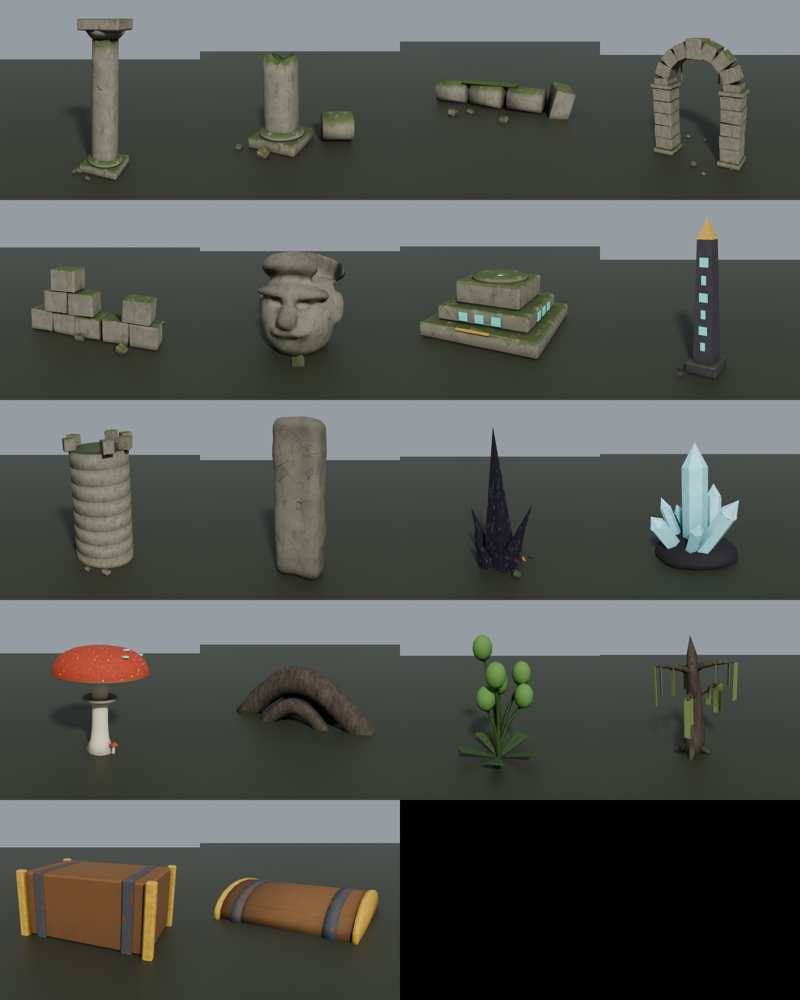

# WILDHOLD v2 — 바뀐 점과 해 볼 일 (쉬운 안내)

> 이 문서는 Roblox Studio 를 처음 쓰는 사람도 따라 할 수 있게 썼어요.
> **열어 둔 `WILDHOLD.rbxlx` 는 건드리지 않았어요.** 새 파일 이름은 **`WILDHOLD_v2.rbxlx`** 예요.

---

## 1. 바로 해 보기 (3분)

1. GitHub 에서 `wildhold/WILDHOLD_v2.rbxlx` 를 내려받아요. (브랜치 `claude/wildhold-v2`)
2. Roblox Studio 에서 **파일 → 열기** 로 `WILDHOLD_v2.rbxlx` 를 열어요.
3. 위쪽의 **▶ 플레이(F5)** 를 눌러요.
4. 로비에서 **▶ 혼자 바로 출발** → 원정 맵으로 가요.

이제 유적 모델 없이도 바로 플레이할 수 있어요. (유적은 일단 **돌 파트로 만든 대체 모델**로 보여요. 더 예쁜 3D 모델로 바꾸려면 아래 3번을 해 주세요.)

---

## 2. 무엇이 바뀌었나요?

### 🏕 시작할 때 기지가 비어 있어요
- 말뚝 울타리, 창고, 펫 우리, 길목 울타리, 처음부터 있던 문·벽·포탑을 **모두 없앴어요.**
- 남은 것: 가운데 **성스러운 모닥불(Core)** 과 **요리 모닥불** 뿐이에요.
- 제작대·벽·포탑은 전부 내가 직접 지어요.

### 🍄 요리가 자동이에요
- **요리 메뉴가 없어졌어요.** 버섯을 가지고 **모닥불 곁에 서 있기만 하면** 0.5초마다 하나씩 **구운 버섯**이 돼요.
- 바닥에 주황색 원이 있어서, 그 안에 서 있으면 된다는 걸 알 수 있어요. 구워질 때마다 불꽃과 "🍄 +1" 이 떠요.

### 🐾 쉬워진 것
- **잡으면 바로 내 펫으로 등록**돼요. (펫 우리까지 걸어갈 필요 없어요)
- **채집할 때 도구를 바꿔 들 필요가 없어요.** 창을 들고 있어도 나무를 치면 가방 속 **가장 좋은 도끼**로, 돌을 치면 **가장 좋은 곡괭이**로 캐요. (처음부터 낡은 곡괭이도 줘요)
- **가방이 아주 커졌어요** (250, 섬유 가방 400, 튼튼한 가방 600). 창고 없이 **어디서나** 가방에 든 재료로 만들어요.
- 떨어진 자원은 **14칸 안에만 와도 저절로 빨려 들어와요.** 들어올 때마다 머리 위에 "+8 🪵" 가 떠요.

### 🔱 창 쥐는 모습
- 예전에는 창을 **팔 앞으로 수평**으로 들어서 이상했어요. 이제 **도끼처럼 비스듬히 세워서** 들어요.
- 공격하면 팔을 내리며 창을 **앞으로 쭉 찔러요.**

### 🌲 채집할 때 손맛
- 도끼질은 더 크게 들었다가 세게 내려찍어요.
- 맞은 **나무·바위가 흔들려요.** 많이 깎일수록 크게 흔들려요.
- 나무를 다 베면 **반대쪽으로 쓰러지면서 쿵!** 흙먼지가 나고 화면이 살짝 흔들려요.
- 바위·덤불은 살짝 튀었다가 땅속으로 꺼져요.

### ✨ 처음 2분이 재밌게 (도파민 포인트)
- **빛기둥 보물상자**: 기지에서 북동쪽으로 70칸쯤에 **하늘로 솟은 빛기둥**이 있어요. 가서 **[E]** 를 누르면 상자가 **덜컹덜컹 → 뚜껑 펑!** 하고 열리며 빛이 터지고, 자원이 튀어나와요.
  - 상자 등급: **일반**(흰색) · **희귀**(파란색) · **영웅**(보라색). 영웅 상자에서는 **한 등급 위 도구**가 나와요.
  - 첫 상자는 대원마다 한 번씩 열 수 있어요 (늘 희귀).
- **반짝이는 황금 나무·바위**: 금빛으로 빛나는 노드는 **수확량 3배!** 기지 근처에도 몇 개 있어요.
- **목표를 하나 끝낼 때마다** "🎯 목표 달성!" 과 작은 보상이 나와요.
  - 새 목표 순서: ① 빛기둥 보물상자 열기 → ② 야생 모슬링 잡기 → ③ 나무 8개 → ④ 제작대 놓기 → ⑤ 벽·포탑 놓기 → ⑥ 첫 밤 버티기 → 유적 탐험

### 🗺 맵이 풍성해졌어요
| 지역 | 새로 생긴 것 |
|---|---|
| 🌋 잿빛 바위 협곡 | 흑요석 첨탑, 빛나는 용암 균열, 수정 무리 |
| 🌲 고목의 숲 | 거대 버섯(빛나는 점), 거대 뿌리 아치, 빛나는 식물 |
| 💧 안개 늪 | 이끼가 늘어진 나무, 반딧불, 수련 |
| 🌿 초원 | 작은 선돌 원 |

- **유적**: 지역마다 2~3곳 (초원 2, 나머지 3). 무너진 신전 기둥, 아치, 큰 석상 머리, 제단, 오벨리스크, **반쯤 잠긴 탑**(늪), 선돌 원.
- 유적 한가운데에 **보물상자**가 있어요. **가장 멀리 있는 유적에는 더 좋은 상자**가 있어요. 열린 상자는 5분 뒤 다시 채워져요.
- 미니맵에 유적은 **금색**으로 보여요.

---

## 3. 유적 3D 모델 넣기 (선택, 10분)

유적을 Blender 로 만든 3D 모델로 바꾸는 방법이에요. 안 해도 게임은 돌아가요.

1. GitHub 에서 `wildhold/assets/ruins/` 폴더를 통째로 내려받아요.
   - ⚠️ **폴더 경로에 한글이 없어야 해요.** 예: `C:\WILDHOLD\ruins\` 에 두세요. (한글 경로에서는 텍스처 업로드가 실패했어요)
2. Studio 위쪽 메뉴 **홈 → 가져오기(Import 3D)** 를 눌러요.
3. `RuinModels.fbx` 를 골라요. 설정은 **기본값 그대로** 두고 **가져오기** 를 눌러요.
   - 텍스처(Texture)가 같이 올라가는지 확인해요.
   - 예전 숲 키트처럼 크기 배율 칸이 있으면 그대로 두세요. (코드가 크기를 알아서 맞춰요)
4. 작업 공간(Workspace)에 **`RuinModels`** 가 생겨요. 탐색기에서 이걸 **ReplicatedStorage** 로 끌어다 놓아요. **이름은 바꾸지 마세요.**
   - 깜빡하고 작업 공간에 둬도, 게임이 시작할 때 코드가 옮겨 줘요.
5. 다시 **▶ 플레이** 하면 유적·보물상자·지역 소품이 3D 모델로 바뀌어요.
6. (다음에 또 안 가져오려면) 탐색기에서 `RuinModels` 우클릭 → **파일로 저장** → `assets/ruins/RuinModels.rbxmx` 로 저장해서 저에게 보내 주세요. 그러면 place 파일에 고정해 드릴게요.

들어 있는 모델 18개: 기둥·부러진 기둥·쓰러진 기둥·아치·무너진 벽·석상 머리·제단·오벨리스크·탑·선돌·흑요석 첨탑·수정 무리·거대 버섯·거대 뿌리·빛나는 식물·이끼 나무·보물상자 몸통·뚜껑.

---

## 4. Studio 에서 확인해 주세요 (체크리스트)

- [ ] 시작하자마자 기지가 비어 있고, 북동쪽에 **빛기둥**이 보이나요?
- [ ] 보물상자가 덜컹거리다 열리고, 자원이 튀어나와 **저절로 가방으로** 들어오나요?
- [ ] 창을 **비스듬히 세워서** 들고 있나요? 찌를 때 앞으로 눕나요?
- [ ] 나무를 칠 때 **흔들리고**, 다 베면 **쓰러지나요?** (안 움직이면 알려 주세요)
- [ ] 모닥불 곁에 서 있으면 버섯이 **저절로 구워지나요?**
- [ ] 금빛으로 빛나는 나무를 찾았나요? 3배가 나오나요?
- [ ] 처음 2분이 지루하지 않았나요? 너무 쉬운가요?

이상한 점이 있으면 화면을 찍어서 보내 주세요.

---

## 5. 숫자 바꾸고 싶을 때

| 바꾸고 싶은 것 | 파일 | 이름 |
|---|---|---|
| 자원 빨아들이는 거리 | `src/shared/Config/GameConfig.lua` | `PickupRadius` (14) |
| 자동 요리 거리·속도 | 같은 파일 | `CookRadius` (15), `CookInterval` (0.5초) |
| 가방 크기 | `src/shared/Config/ItemConfig.lua` | `BaseCapacity`, `FiberBag`, `SturdyBag` |
| 보물상자 전리품·다시 채우는 시간 | `src/shared/Config/ChestConfig.lua` | `Tiers`, `Refill` (300초) |
| 첫 상자 거리 | 같은 파일 | `Starter.Distance` (70) |
| 지역별 유적 수 | 같은 파일 | `Ruins` |
| 황금 노드 개수·3배 | `src/server/Services/ResourceService.lua` | 맨 위 `GOLD` |
| 목표 보상 | `src/server/Services/TutorialService.lua` | `S.Rewards` |
| 창 기울기 | `src/shared/Visuals/ToolLook.lua` | `SPEAR_LEAN` (-62) |
| 다시 처음 구조물을 주고 싶으면 | `src/shared/Config/BuildConfig.lua` | `Starter` (주석에 예전 값이 있어요) |

숫자를 바꾼 뒤에는 `python3 tools/build_place.py WILDHOLD_v2.rbxlx` 로 place 파일을 다시 만들어요.
